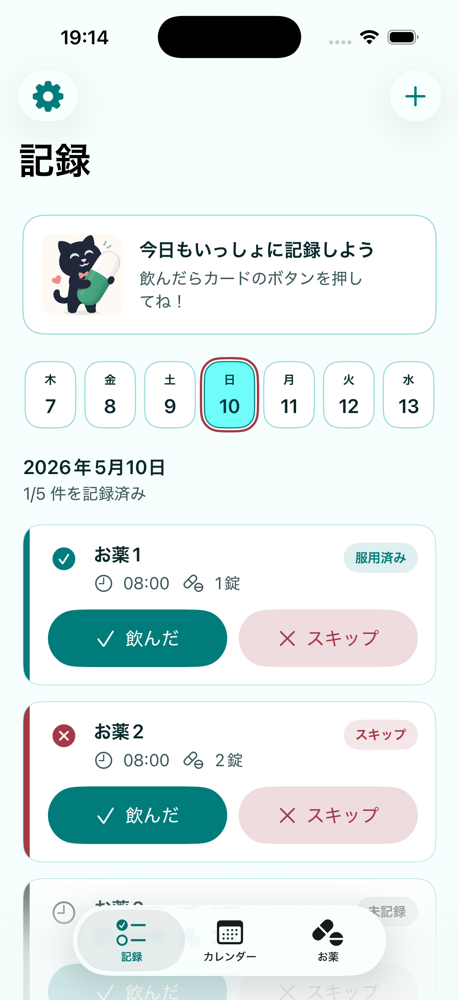
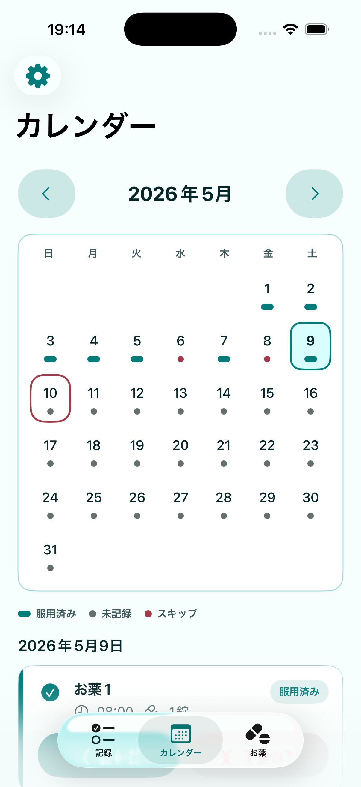
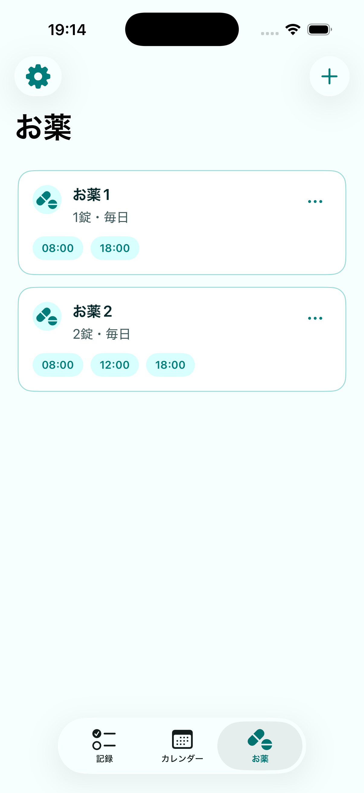
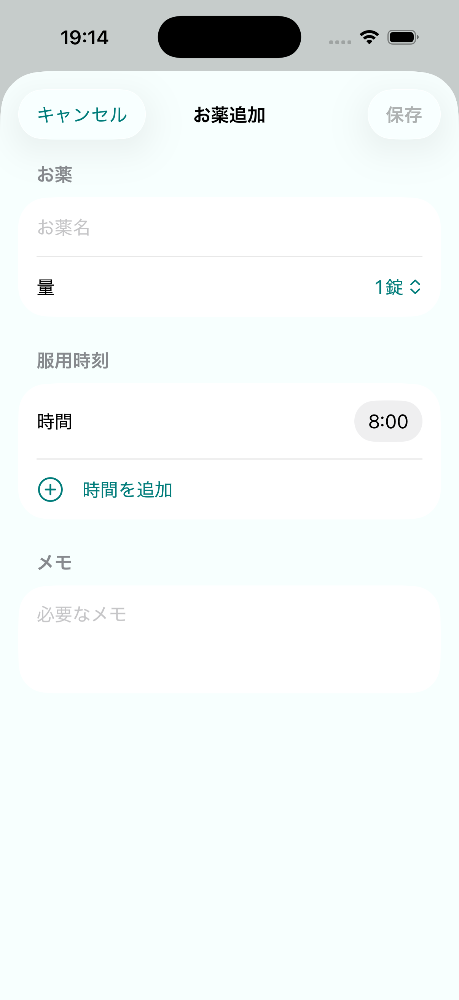

# MediLog

MediLog は、毎日の服薬予定と記録を管理するための iOS アプリです。

薬の名前、服用時刻、量を登録しておくと、日ごとの服薬予定を確認できます。服用した予定には「飲んだ」、飲まなかった予定には「スキップ」を記録でき、カレンダーから過去の服薬状況も振り返れます。

> MediLog は服薬管理を補助するアプリです。薬の飲み方、量、飲み忘れ時の対応、服用の中止や変更については、必ず医師・薬剤師などの医療専門家の指示に従ってください。

## 主な機能

- 毎日決まった時刻に飲む薬を登録
- 服用時刻と服用量の管理
- 日ごとの服薬予定の表示
- 「飲んだ」「スキップ」による服薬記録
- 月カレンダーで服薬状況を確認
- 登録した時刻にローカル通知

## スクリーンショット

| 記録 | カレンダー | お薬 | お薬追加 |
| --- | --- | --- | --- |
|  |  |  |  |

## 画面

### 記録

その日の服薬予定を確認し、服用状況を記録する画面です。

画面上部の日付スライダーで日付を切り替えられます。選択した日の服薬予定がカード形式で表示され、各カードから「飲んだ」または「スキップ」を記録できます。

### カレンダー

月単位で服薬状況を確認する画面です。

月カレンダーには、日ごとの状態が小さな印で表示されます。日付を選ぶと、その日の服薬予定と記録内容を一覧で確認できます。

### お薬

登録済みの薬を管理する画面です。

薬の名前、服用時刻、服用量を一覧で確認できます。新しい薬の追加、登録済みの薬の編集、削除もこの画面から行います。

現在は「毎日、指定時刻に飲む」薬の管理に対応しています。

### お薬追加・編集

薬の情報を登録または編集する画面です。

登録できる内容は、薬の名前、服用時刻、服用量、単位です。

## データとプライバシー

MediLog はローカル完結型のアプリです。

薬の登録情報、服薬記録、設定情報は端末内に保存されます。現時点では、独自サーバーへの同期、ログイン、複数端末共有には対応していません。

通知は iOS のローカル通知機能を使用します。通知の表示や通知音は、端末の通知設定、集中モード、マナーモード、バッテリー状態などの影響を受ける場合があります。

## 動作環境

- iOS 18 以降

## クレジット

サードパーティ素材や参考元のクレジットは [THIRD_PARTY_NOTICES.md](THIRD_PARTY_NOTICES.md) を参照してください。

## ライセンス

コードのライセンスは今後 `LICENSE` で定義します。
