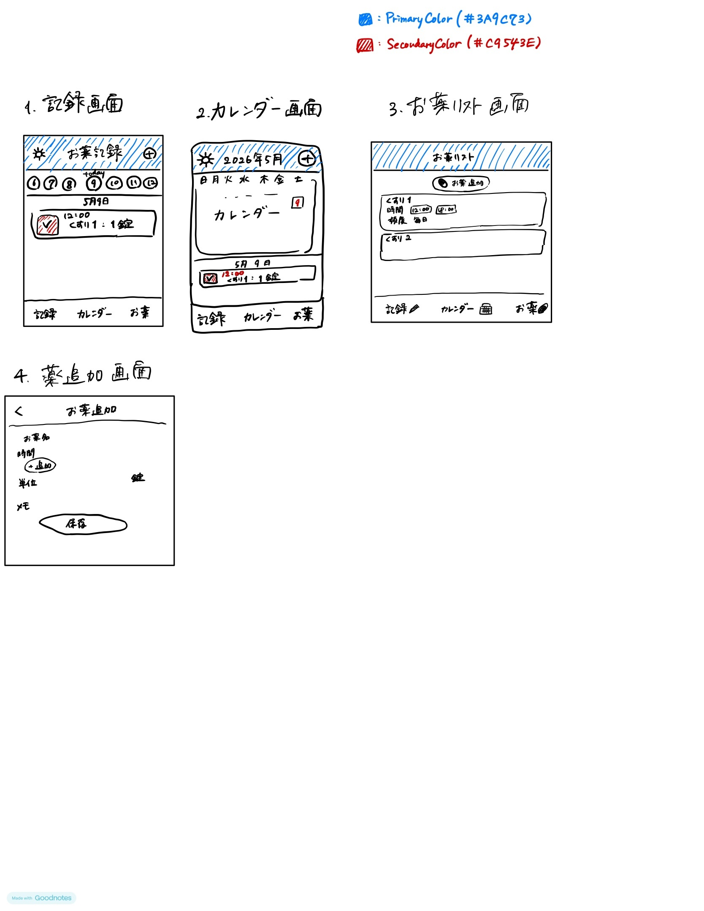

# Medilog

薬を登録することで，毎日の服薬を管理し，飲み忘れを防止するアプリ

## 開発方針

まずはローカル完結型のiOSアプリとしてMVPを実装する。

- 対象OS: iOS 17+
- UI: SwiftUI
- データ保存: SwiftData
- 通知: UserNotifications
- 同期・ログイン: MVPでは対応しない

### MVPの範囲

- 薬は「毎日，指定時刻に飲む」スケジュールのみ対応する
- 薬の登録，変更，削除ができる
- 今日または選択日の服薬予定を表示できる
- 服薬予定に対して，服用済み・スキップを記録できる
- 月カレンダーで日ごとの服薬状況を確認できる
- 登録した服用時刻にローカル通知を送る

### MVPでは扱わないこと

- 曜日指定
- 隔日や数日おきの服用
- 食前・食後などの服用タイミング分類
- 頓服
- 複数端末同期
- 家族・介護者との共有

## 要件定義

### 必須要件

- 薬の名前，服用時間，量を登録，変更，削除できる
- スケジュールされた薬について，毎日の服用状況を記録できる

### 追加要件

- スケジュールに基づき，服用をお知らせする
- アプリ内のカレンダー機能で，現在登録されている薬やその服用状況を管理できる

## 画面構成

### 記録画面

今日の服薬予定を中心に表示する画面。

- 上部に日付選択を表示する
- 選択日の服薬予定をカード形式で表示する
- 予定ごとに薬名，服用時刻，量，状態を表示する
- 予定ごとに「飲んだ」「スキップ」を記録できる

### カレンダー画面

月カレンダーと選択日の服薬一覧を表示する画面。

- 月単位のカレンダーを表示する
- 日付を選択できる
- 選択日の服薬予定と服薬状況を一覧表示する
- 日ごとの状態がわかるように，カレンダー上に簡単な印を表示する

### お薬リスト画面

登録済みの薬を管理する画面。

- 登録済みの薬を一覧表示する
- 薬名，服用時刻，量，頻度を表示する
- 薬の追加画面へ遷移できる
- 既存の薬を編集・削除できる

### お薬追加・編集画面

薬の情報を登録・編集する画面。

- 薬名
- 服用時刻
- 量
- 単位
- メモ

## 服薬状態の仕様

服薬予定の状態は，次の3つとする。画面表示も保存状態と同じ状態を使う。

| 状態 | 意味 |
| --- | --- |
| `pending` | 未記録 |
| `taken` | 服用済み |
| `skipped` | 飲まなかったことを明示的に記録済み |

予定時刻を過ぎても，ユーザーが「飲んだ」または「スキップ」を押していない場合は `pending` のままとする。予定時刻前の未記録状態と同じ表示にする。

予定時刻を過ぎても自動的に `skipped` にはしない。実際には服用したが記録し忘れただけの場合があるため，ユーザーが明示的に「飲んだ」または「スキップ」を選ぶまで `pending` として扱う。

## データモデル案

### Medication

薬の登録情報。

- `id`
- `name`
- `doseAmount`
- `doseUnit`
- `times`
- `memo`
- `isActive`
- `createdAt`
- `updatedAt`

### MedicationLog

日ごとの服薬予定と記録。

- `id`
- `medicationId`
- `scheduledDate`
- `scheduledTime`
- `status`
- `takenAt`
- `createdAt`
- `updatedAt`

## デザインメモ

- Primary Color: `#3A9CE3`
- Secondary Color: `#C9543E`
- 主要ナビゲーションは「記録」「カレンダー」「お薬」の3タブ構成とする
- カードやボタンは，服薬状況がひと目でわかる表示を優先する

## 画面のイメージ

